# 🍽️ Landars Food Platform


A comprehensive, enterprise-grade food delivery platform built with modern technologies, featuring a Django REST API backend, Next.js frontend, PostgreSQL database, and advanced security features.

## 📋 Table of Contents

- [Overview](#overview)
- [Features](#features)
- [Architecture](#architecture)
- [Project Structure](#project-structure)
- [Prerequisites](#prerequisites)
- [Installation](#installation)
- [Configuration](#configuration)
- [Usage](#usage)
- [API Documentation](#api-documentation)
- [Security Features](#security-features)
- [Backup & Recovery](#backup--recovery)
- [Deployment](#deployment)
- [Development](#development)
- [Contributing](#contributing)
- [License](#license)
- [Support](#support)

## 🎯 Overview

Landars Food Platform is a full-stack food delivery application designed for restaurants and food businesses. It provides a complete solution for managing orders, customers, products, and payments with enterprise-grade security and scalability.

### Key Highlights

- **Modern Tech Stack**: Django 5.2, Next.js 15, PostgreSQL, Docker
- **Enterprise Security**: JWT authentication, rate limiting, account lockout
- **Advanced Backup**: Point-in-Time Recovery (PITR) with WAL archiving
- **Production Ready**: Comprehensive monitoring, logging, and deployment scripts
- **Scalable Architecture**: Microservices-ready with container orchestration

## ✨ Features

### 🔐 Authentication & Security

- **JWT-based Authentication** with token rotation and blacklisting
- **Email Verification** with secure token management
- **Password Reset** with enhanced security and rate limiting
- **Account Lockout** protection against brute force attacks
- **Rate Limiting** for API endpoints and authentication
- **Security Audit Logging** with comprehensive monitoring

### 🛒 E-commerce Features

- **Product Management** with categories and subcategories
- **Shopping Cart** with persistent storage
- **Wishlist** functionality
- **Order Management** with status tracking
- **Payment Integration** with secure payment information storage
- **Invoice Generation** with PDF export

### 👤 User Management

- **Custom User Model** with email and name authentication
- **User Profiles** with address and contact information
- **Payment Methods** management
- **Order History** and tracking
- **Email Notifications** for verification and password reset

### 🗄️ Database Features

- **PostgreSQL** with advanced configuration
- **Point-in-Time Recovery** (PITR) for data protection
- **Automated Backups** with S3 integration
- **Database Migrations** with conflict resolution
- **Performance Optimization** with proper indexing

### 🚀 DevOps & Deployment

- **Docker Containerization** with multi-stage builds
- **Docker Compose** orchestration
- **Nginx Reverse Proxy** with SSL support
- **Environment Configuration** with secure secrets management
- **CI/CD Ready** with automated deployment scripts

## 🏗️ Architecture

```mermaid
graph TB
    subgraph "Frontend Layer"
        A[Next.js Frontend<br/>Port 3000]
    end

    subgraph "Backend Layer"
        B[Django REST API<br/>Port 8000]
        C[PostgreSQL Database<br/>Port 5432]
    end

    subgraph "Infrastructure Layer"
        D[Nginx Reverse Proxy<br/>Port 80/443]
        E[Docker Containers]
        F[AWS S3 Storage]
    end

    A --> D
    D --> B
    B --> C
    B --> F

    style A fill:#61dafb
    style B fill:#092e20
    style C fill:#336791
    style D fill:#009639
```



## 📁 Project Structure

```
FoodPlatform/
├── backend/                    # Django REST API
│   ├── account/               # User authentication & management
│   ├── api/                   # Core business logic
│   ├── backend/               # Django settings & configuration
│   ├── static/                # Static files
│   ├── templates/             # Email templates
│   └── requirements.txt      # Python dependencies
├── frontend-marketplace/      # Next.js frontend application
│   ├── src/
│   │   ├── app/              # Next.js app router pages
│   │   ├── components/       # React components
│   │   ├── contexts/         # React contexts
│   │   ├── hooks/            # Custom React hooks
│   │   └── utils/            # Utility functions
│   └── package.json           # Node.js dependencies
├── postgresql/               # PostgreSQL configuration
├── nginx/                    # Nginx configuration
├── management/               # Deployment & maintenance scripts
├── db_backups/              # Database backup storage
├── docker compose.yml       # Container orchestration
└── README.md               # This file
```

## 🔧 Prerequisites

Before running the application, ensure you have the following installed:

- **Docker** (20.10+) and **Docker Compose** (2.0+)
- **Node.js** (18+) and **npm** (9+) for local development
- **Python** (3.12+) for backend development
- **Git** for version control

## 🚀 Installation

### 1. Clone the Repository

```bash
git clone <repository-url>
cd FoodPlatform
```

### 2. Environment Setup

```bash
# Copy environment template
cp .env.example .env

# Edit environment variables
nano .env
```

### 3. Start the Application

```bash
# Start all services
docker compose up -d

# Check service status
docker compose ps
```

### 4. Database Setup

```bash
# Run database migrations
docker compose exec backend python manage.py migrate

# Create superuser
docker compose exec backend python manage.py createsuperuser

# Collect static files
docker compose exec backend python manage.py collectstatic
```

## ⚙️ Configuration

### Environment Variables

Create a `.env` file in the project root with the following variables:

```env
# Database Configuration
POSTGRES_DB=landarsfood
POSTGRES_USER=landarsfood
POSTGRES_PASSWORD=your_secure_password
POSTGRES_HOST=postgres
POSTGRES_PORT=5432

# Django Configuration
SECRET_KEY=your_django_secret_key
DEBUG=False
ALLOWED_HOSTS=localhost,your-domain.com

# API Configuration
URL_BASE=https://your-domain.com
NEXT_PUBLIC_API_BASE_URL=https://your-domain.com/api

# Email Configuration
EMAIL_HOST=smtp.gmail.com
EMAIL_PORT=587
EMAIL_USE_TLS=True
EMAIL_HOST_USER=your-email@gmail.com
EMAIL_HOST_PASSWORD=your-app-password
DEFAULT_FROM_EMAIL=noreply@landarsfood.com

# AWS S3 Configuration (Optional)
AWS_ACCESS_KEY_ID=your_aws_access_key
AWS_SECRET_ACCESS_KEY=your_aws_secret_key
AWS_STORAGE_BUCKET_NAME=your-bucket-name
AWS_S3_REGION_NAME=us-east-1

# Business Information
BUSINESS_NAME=Landars Food
BUSINESS_ADDRESS=Your Business Address
BUSINESS_CITY=Your City
BUSINESS_COUNTRY=Your Country
BUSINESS_POSTAL_CODE=Your Postal Code
```

### Generate Secret Key

```bash
cd backend
python generate_secret_key.py
```

## 🎮 Usage

### Access Points

- **Frontend**: http://localhost:3000
- **Backend API**: http://localhost:8000
- **Admin Panel**: http://localhost:8000/admin
- **API Documentation**: http://localhost:8000/api/

### Development Commands

```bash
# Backend development
docker compose exec backend bash
python manage.py runserver
python manage.py shell
python manage.py test

# Frontend development
docker compose exec frontend-marketplace bash
npm run dev
npm run build
npm run lint

# Database operations
docker compose exec backend python manage.py migrate
docker compose exec backend python manage.py makemigrations
docker compose exec backend python manage.py collectstatic
```

## 📚 API Documentation

### Authentication Endpoints

```http
POST /api/auth/register/          # User registration
POST /api/auth/login/            # User login
POST /api/auth/logout/           # User logout
POST /api/auth/refresh/          # Token refresh
POST /api/auth/verify-email/     # Email verification
POST /api/auth/resend-verification/ # Resend verification email
POST /api/auth/forgot-password/  # Password reset request
POST /api/auth/reset-password/  # Password reset confirmation
```

### User Management

```http
GET    /api/users/profile/       # Get user profile
PUT    /api/users/profile/       # Update user profile
GET    /api/users/payment-methods/ # Get payment methods
POST   /api/users/payment-methods/ # Add payment method
DELETE /api/users/payment-methods/{id}/ # Remove payment method
```

### Product Management

```http
GET    /api/products/            # List products
GET    /api/products/{id}/       # Get product details
GET    /api/categories/          # List categories
GET    /api/categories/{id}/     # Get category details
```

### Order Management

```http
GET    /api/orders/              # List user orders
POST   /api/orders/               # Create new order
GET    /api/orders/{id}/          # Get order details
PUT    /api/orders/{id}/          # Update order
DELETE /api/orders/{id}/          # Cancel order
```

### Cart & Wishlist

```http
GET    /api/cart/                 # Get cart items
POST   /api/cart/add/             # Add item to cart
PUT    /api/cart/update/{id}/     # Update cart item
DELETE /api/cart/remove/{id}/     # Remove cart item
GET    /api/wishlist/             # Get wishlist
POST   /api/wishlist/add/         # Add to wishlist
DELETE /api/wishlist/remove/{id}/ # Remove from wishlist
```

## 🔒 Security Features

### Authentication Security

- **JWT Tokens**: Secure token-based authentication with rotation
- **Email Verification**: Required email verification for new accounts
- **Password Reset**: Secure password reset with time-limited tokens
- **Account Lockout**: Automatic lockout after failed login attempts
- **Rate Limiting**: API rate limiting to prevent abuse

### Data Protection

- **Encrypted Storage**: Sensitive data encrypted at rest
- **Secure Headers**: Security headers for XSS and CSRF protection
- **Input Validation**: Comprehensive input validation and sanitization
- **SQL Injection Prevention**: Parameterized queries and ORM usage

### Monitoring & Auditing

- **Security Logging**: Comprehensive audit trail of all actions
- **Failed Login Tracking**: Monitoring and alerting for suspicious activity
- **Token Management**: Automatic cleanup of expired tokens
- **Performance Monitoring**: Database and application performance tracking

## 💾 Backup & Recovery

### Automated Backup System

```bash
# Create backup
./management/pg_backup.sh backup

# Create comprehensive backup (SQL + PITR)
./management/pg_backup.sh full-backup

# Check backup status
./management/pg_backup.sh status

# Restore from backup
./management/pg_backup.sh restore
```

### Point-in-Time Recovery (PITR)

```bash
# Restore to specific point in time
./management/pg_backup.sh pitr-restore --target-time '2024-01-15 14:30:00'
```

### Backup Features

- **Automated Daily Backups**: Scheduled backup creation
- **S3 Integration**: Cloud storage for backup redundancy
- **WAL Archiving**: Continuous transaction log archiving
- **Backup Verification**: Automated backup integrity checks
- **Cleanup Automation**: Intelligent cleanup of old backups

## 🚀 Deployment

### Production Deployment

```bash
# Deploy to production
./management/deploy.sh

# Check deployment status
docker compose ps
docker compose logs
```

### Environment-Specific Configuration

- **Development**: Local development with hot reloading
- **Staging**: Pre-production testing environment
- **Production**: Live environment with security hardening

### SSL Configuration

```bash
# Generate SSL certificates
openssl req -x509 -nodes -days 365 -newkey rsa:2048 \
  -keyout nginx/certs/landarsfood.key \
  -out nginx/certs/landarsfood.crt
```

## 🛠️ Development

### Backend Development

```bash
# Enter backend container
docker compose exec backend bash

# Install dependencies
pip install -r requirements.txt

# Run development server
python manage.py runserver 0.0.0.0:8000

# Run tests
python manage.py test

# Create migrations
python manage.py makemigrations

# Apply migrations
python manage.py migrate
```

### Frontend Development

```bash
# Enter frontend container
docker compose exec frontend-marketplace bash

# Install dependencies
npm install

# Run development server
npm run dev

# Build for production
npm run build

# Run linting
npm run lint
```

### Database Management

```bash
# Fix database sequences
./management/fix_db_sequence.sh

# Migrate from SQLite to PostgreSQL
./management/migrate_to_postgres.py

# Database health check
docker compose exec postgres psql -U landarsfood -d landarsfood -c "SELECT version();"
```

## 🧪 Testing

### Backend Testing

```bash
# Run all tests
docker compose exec backend python manage.py test

# Run specific app tests
docker compose exec backend python manage.py test account

# Run with coverage
docker compose exec backend coverage run --source='.' manage.py test
docker compose exec backend coverage report
```

### Frontend Testing

```bash
# Run frontend tests
docker compose exec frontend-marketplace npm test

# Run linting
docker compose exec frontend-marketplace npm run lint
```

## 📊 Monitoring & Logging

### Application Logs

```bash
# View all logs
docker compose logs

# View specific service logs
docker compose logs backend
docker compose logs frontend-marketplace
docker compose logs postgres

# Follow logs in real-time
docker compose logs -f backend
```

### Database Monitoring

```bash
# Check database status
docker compose exec postgres pg_isready

# View database statistics
docker compose exec postgres psql -U landarsfood -d landarsfood -c "SELECT * FROM pg_stat_activity;"
```

## 🤝 Contributing

We welcome contributions! Please follow these guidelines:

### Development Workflow

1. **Fork the repository**
2. **Create a feature branch**
   ```bash
   git checkout -b feature/your-feature-name
   ```
3. **Make your changes**
4. **Run tests**
   ```bash
   docker compose exec backend python manage.py test
   docker compose exec frontend-marketplace npm test
   ```
5. **Commit your changes**
   ```bash
   git commit -m "Add your feature description"
   ```
6. **Push to your branch**
   ```bash
   git push origin feature/your-feature-name
   ```
7. **Open a Pull Request**

### Code Standards

- **Python**: Follow PEP 8 style guidelines
- **JavaScript/TypeScript**: Use ESLint configuration
- **Django**: Follow Django best practices
- **React**: Use functional components and hooks
- **Documentation**: Update documentation for new features

### Pull Request Guidelines

- Provide a clear description of changes
- Include tests for new features
- Update documentation as needed
- Ensure all tests pass
- Follow the existing code style

## 📄 License

This project is licensed under the MIT License - see the [LICENSE](LICENSE) file for details.

## 🆘 Support

### Getting Help

1. **Check the documentation** in this README
2. **Review existing issues** on GitHub
3. **Create a new issue** with detailed information
4. **Contact support** at support@landarsfood.com

### Troubleshooting

#### Common Issues

**Database Connection Issues:**

```bash
# Check database status
docker compose exec postgres pg_isready

# Restart database
docker compose restart postgres
```

**Frontend Build Issues:**

```bash
# Clear node modules and reinstall
docker compose exec frontend-marketplace rm -rf node_modules
docker compose exec frontend-marketplace npm install
```

**Backend Migration Issues:**

```bash
# Reset migrations
docker compose exec backend python manage.py migrate --fake-initial
```

#### Log Analysis

```bash
# Check application logs
docker compose logs backend | grep ERROR
docker compose logs frontend-marketplace | grep ERROR

# Check database logs
docker compose logs postgres | grep ERROR
```

### Performance Optimization

- **Database Indexing**: Optimized queries with proper indexes
- **Caching**: Redis integration for improved performance
- **CDN**: Static file delivery optimization
- **Load Balancing**: Horizontal scaling capabilities

---

## 🎉 Acknowledgments

- **Django Community** for the excellent framework
- **Next.js Team** for the amazing React framework
- **PostgreSQL Community** for the robust database system
- **Docker Team** for containerization technology
- **All Contributors** who have helped improve this project

---

**Built with ❤️ by the Landars Food Team**

For more information, visit our [website](https://landarsfood.com) or contact us at [info@landarsfood.com](mailto:info@landarsfood.com).
